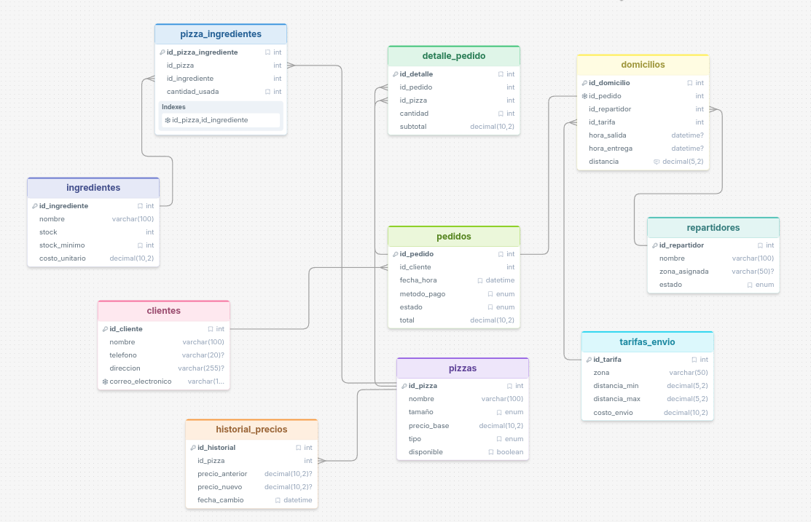

<div align="center">

# 🍕 Sistema de Gestión de Pizzería y Domicilios 🛵

*Automatizando el sabor, desde el horno hasta tu puerta.*

<br>


&nbsp;&nbsp;&nbsp;&nbsp;

&nbsp;&nbsp;&nbsp;&nbsp;


<br><br>

</div>

---

### 📖 Sobre el Proyecto

Base de datos relacional construida en **MySQL** para gestionar el proceso integral de venta de pizzas y domicilios. Este sistema controla de manera eficiente:
* 👥 Clientes
* 🍕 Catálogo de pizzas e ingredientes
* 📝 Pedidos
* 🛵 Repartidores y entregas

🛠️ **Tecnología implementada bajo el capó:**
Implementa *funciones almacenadas*, *procedimientos*, *triggers*, *vistas* y *consultas analíticas* avanzadas para automatizar y agilizar toda la lógica de negocio.

## Estructura del proyecto

```
├── database.sql       -- Creación de la BD, tablas, llaves foráneas y datos de ejemplo
├── funciones.sql      -- Funciones almacenadas y procedimiento (CREATE FUNCTION / PROCEDURE)
├── triggers.sql       -- Triggers de auditoría y automatización (CREATE TRIGGER)
├── vistas.sql         -- Vistas de reportes (CREATE VIEW)
├── consultas.sql      -- Consultas SQL complejas (JOIN, subconsultas, agregaciones)
└── README.md
```

## 1. Descripción del proyecto

El sistema permite:

- **Registrar clientes** y su historial de pedidos.
- **Administrar el catálogo de pizzas** y la relación con los ingredientes que las componen.
- **Controlar el stock de ingredientes** y su nivel mínimo permitido, con descuento
  automático vía trigger al registrar cada pedido.
- **Registrar pedidos** con su detalle (una o varias pizzas por pedido), método de pago,
  estado y total calculado automáticamente (subtotal + envío + IVA 19 %).
- **Asignar repartidores** y gestionar los domicilios: hora de salida, hora de entrega,
  distancia y tarifa de envío aplicada según zona.
- **Auditar cambios de precio** de las pizzas mediante trigger que registra
  automáticamente el historial de modificaciones.
- **Evaluar ganancia neta diaria** a través de función que resta el costo de
  ingredientes a los ingresos por ventas.
- **Generar reportes** mediante vistas: resumen de clientes, desempeño de
  repartidores y alertas de stock bajo.
- **Cerrar pedidos** con un procedimiento almacenado que actualiza estado y total
  en una sola operación.

## 2. Corrección del diseño original

El archivo exportado desde drawSQL (`drawSQL-mysql-export-2026-07-14.sql`) tenía
errores que impedían su ejecución y comprometían la integridad de los datos.
Se corrigieron antes de generar `database.sql`:

| # | Problema original | Corrección aplicada |
|---|---|---|
| 1 | `ENUM('')` vacíos en `tamaño`, `tipo`, `metodo_pago` y `estado` | Se definieron los valores reales de cada enumeración |
| 2 | `DEFAULT '0, ≥ 0'`, `DEFAULT '≥ 1'`, `DEFAULT 'En kilómetros'` (texto descriptivo usado como valor por defecto, sintácticamente inválido) | Se reemplazaron por `DEFAULT` numéricos correctos y `CHECK` constraints donde aplica |
| 3 | Relaciones foráneas invertidas: `pizzas → pizza_ingredientes`, `repartidores → domicilios`, `ingredientes → pizza_ingredientes`, `pedidos → detalle_pedido` | Se corrigió la dirección: las tablas "hijas" (`pizza_ingredientes`, `domicilios`, `detalle_pedido`) referencian a las tablas "padre" |
| 4 | `pizza_ingredientes.id_pizza` con `AUTO_INCREMENT` (siendo una llave foránea) y la PK real sin autoincremento | `id_pizza_ingrediente` es ahora la PK autoincremental; `id_pizza` e `id_ingrediente` son FKs normales |
| 5 | Faltaban FKs: `detalle_pedido → pedidos`, `domicilios → pedidos`, `domicilios → repartidores` | Se agregaron todas las relaciones necesarias |
| 6 | Tipos de datos inconsistentes entre PK y FK (`BIGINT` vs `INT`, `UNSIGNED` faltante) | Se unificaron todos los identificadores como `INT UNSIGNED` |
| 7 | Sin charset UTF-8, columnas obligatorias sin `NOT NULL` | Base de datos creada con `utf8mb4`; se agregaron `NOT NULL` a los campos requeridos por el negocio |

## 3. Tablas y relaciones

| Tabla | Descripción | Relaciones |
|---|---|---|
| `clientes` | Datos de contacto de cada cliente | 1 cliente → N pedidos |
| `pizzas` | Catálogo de pizzas (nombre, tamaño, precio, tipo) | 1 pizza → N pizza_ingredientes, N detalle_pedido, N historial_precios |
| `ingredientes` | Insumos con control de stock | 1 ingrediente → N pizza_ingredientes |
| `pizza_ingredientes` | Tabla puente N:M entre `pizzas` e `ingredientes`, con la cantidad usada de cada insumo | FK a `pizzas` y a `ingredientes` |
| `repartidores` | Personal de reparto, zona asignada y disponibilidad | 1 repartidor → N domicilios |
| `tarifas_envio` | Costo de envío según zona y rango de distancia | 1 tarifa → N domicilios |
| `pedidos` | Encabezado del pedido (cliente, fecha, método de pago, estado, total) | FK a `clientes`; 1 pedido → N detalle_pedido; 1 pedido → 1 domicilio |
| `detalle_pedido` | Pizzas y cantidades que componen cada pedido | FK a `pedidos` y a `pizzas` |
| `domicilios` | Datos de la entrega: repartidor, tarifa, horarios y distancia | FK a `pedidos` (1:1), `repartidores` y `tarifas_envio` |
| `historial_precios` | Auditoría de cambios de precio en `pizzas` | FK a `pizzas` |

### Diagrama de relaciones DrawSQL



## 4. Ejemplos de consultas

### Consultas ilustrativas (relaciones entre tablas)

Ejemplos que muestran cómo se relacionan las tablas para obtener información
del negocio:

```sql
-- Pedidos de un cliente con el detalle de pizzas solicitadas
SELECT c.nombre, p.id_pedido, p.fecha_hora, pz.nombre AS pizza, dp.cantidad
FROM pedidos p
JOIN clientes c ON c.id_cliente = p.id_cliente
JOIN detalle_pedido dp ON dp.id_pedido = p.id_pedido
JOIN pizzas pz ON pz.id_pizza = dp.id_pizza
WHERE c.id_cliente = 1;

-- Ingredientes de una pizza específica
SELECT pz.nombre AS pizza, i.nombre AS ingrediente, pi.cantidad_usada
FROM pizza_ingredientes pi
JOIN pizzas pz ON pz.id_pizza = pi.id_pizza
JOIN ingredientes i ON i.id_ingrediente = pi.id_ingrediente
WHERE pz.id_pizza = 1;

-- Estado de un domicilio con su repartidor y tarifa
SELECT p.id_pedido, r.nombre AS repartidor, t.zona, d.distancia, t.costo_envio
FROM domicilios d
JOIN pedidos p ON p.id_pedido = d.id_pedido
JOIN repartidores r ON r.id_repartidor = d.id_repartidor
JOIN tarifas_envio t ON t.id_tarifa = d.id_tarifa;
```

### Uso de vistas

```sql
-- Resumen de clientes: cuánto han gastado y cuántos pedidos han realizado
SELECT * FROM vw_resumen_pedidos_clientes;

-- Desempeño de repartidores: entregas completadas y tiempo promedio
SELECT * FROM vw_desempeno_repartidores;

-- Alertas de inventario: ingredientes por debajo del stock mínimo
SELECT * FROM vw_stock_bajo;
```

### Uso de funciones y procedimiento almacenado

```sql
-- Calcular la ganancia neta de un día específico
SELECT fn_ganancia_neta_diaria('2026-07-01') AS ganancia_neta;

-- Cerrar un pedido: cambia estado a 'Entregado' y calcula el total final
CALL sp_entregar_pedido(4);

-- Verificar el resultado del cierre
SELECT id_pedido, estado, total FROM pedidos WHERE id_pedido = 4;
```

## 5. Instrucciones para ejecutar el script

### Requisitos
- MySQL 8.x o MariaDB 10.11+ (soporte de `CHECK CONSTRAINT` y `utf8mb4`).
- Cliente `mysql` en línea de comandos o DBeaver.

### Desde la línea de comandos

```bash
mysql -u <usuario> -p --default-character-set=utf8mb4 < database.sql
```

> Importante: usar `--default-character-set=utf8mb4` (o configurarlo en el
> cliente) para que los nombres con tildes (`tamaño`, `dirección`, etc.) se
> inserten correctamente.

Una vez creada la base y las tablas, ejecutar en este orden los demás scripts
cuando estén desarrollados:

```bash
mysql -u <usuario> -p pizzeria_db --default-character-set=utf8mb4 < funciones.sql
mysql -u <usuario> -p pizzeria_db --default-character-set=utf8mb4 < triggers.sql
mysql -u <usuario> -p pizzeria_db --default-character-set=utf8mb4 < vistas.sql
mysql -u <usuario> -p pizzeria_db --default-character-set=utf8mb4 < consultas.sql
```

### Desde DBeaver

1. Crear una nueva conexión MySQL/MariaDB.
2. En las propiedades de conexión, verificar que el charset sea `utf8mb4`.
3. Abrir `database.sql` y ejecutar el script completo (`Execute SQL Script`,
   no solo la sentencia bajo el cursor).
4. Repetir con `funciones.sql`, `triggers.sql`, `vistas.sql` y `consultas.sql`
   una vez estén completos.

## 6. Funciones, Procedimiento, Triggers, Vistas y Consultas

A continuación se documentan todos los objetos de base de datos y consultas
implementados, junto con su código SQL completo.

### 6.1 Funciones almacenadas (`funciones.sql`)

#### `fn_calcular_total_pedido`

Calcula el total final de un pedido sumando el subtotal de las pizzas
más el costo de envío, y aplica el 19 % de IVA.

| Atributo | Valor |
|---|---|
| **Parámetro** | `p_id_pedido INT` |
| **Retorno** | `DECIMAL(10,2)` |

```sql
CREATE FUNCTION fn_calcular_total_pedido(p_id_pedido INT)
RETURNS DECIMAL(10,2)
DETERMINISTIC READS SQL DATA
BEGIN
    DECLARE v_subtotal DECIMAL(10,2) DEFAULT 0;
    DECLARE v_envio DECIMAL(10,2) DEFAULT 0;
    DECLARE v_total DECIMAL(10,2);
    SELECT IFNULL(SUM(subtotal), 0) INTO v_subtotal
    FROM detalle_pedido WHERE id_pedido = p_id_pedido;
    SELECT IFNULL(te.costo_envio, 0) INTO v_envio
    FROM domicilios d
    INNER JOIN tarifas_envio te ON d.id_tarifa = te.id_tarifa
    WHERE d.id_pedido = p_id_pedido;
    SET v_total = (v_subtotal + v_envio) * 1.19;
    RETURN ROUND(v_total, 2);
END;
```

#### `fn_ganancia_neta_diaria`

Calcula la ganancia neta de un día restando a los ingresos por ventas
el costo de los ingredientes consumidos.

| Atributo | Valor |
|---|---|
| **Parámetro** | `p_fecha DATE` |
| **Retorno** | `DECIMAL(10,2)` |

```sql
CREATE FUNCTION fn_ganancia_neta_diaria(p_fecha DATE)
RETURNS DECIMAL(10,2)
DETERMINISTIC READS SQL DATA
BEGIN
    DECLARE v_ventas DECIMAL(10,2) DEFAULT 0;
    DECLARE v_costos DECIMAL(10,2) DEFAULT 0;
    SELECT IFNULL(SUM(total), 0) INTO v_ventas
    FROM pedidos
    WHERE DATE(fecha_hora) = p_fecha AND estado = 'Entregado';
    SELECT IFNULL(SUM(pi.cantidad_usada * dp.cantidad * i.costo_unitario), 0) INTO v_costos
    FROM pedidos p
    INNER JOIN detalle_pedido dp ON p.id_pedido = dp.id_pedido
    INNER JOIN pizza_ingredientes pi ON dp.id_pizza = pi.id_pizza
    INNER JOIN ingredientes i ON pi.id_ingrediente = i.id_ingrediente
    WHERE DATE(p.fecha_hora) = p_fecha AND p.estado = 'Entregado';
    RETURN ROUND(v_ventas - v_costos, 2);
END;
```

### 6.2 Procedimiento almacenado (`funciones.sql`)

#### `sp_entregar_pedido`

Marca un pedido como `'Entregado'` y actualiza su `total` invocando
a `fn_calcular_total_pedido`.

| Atributo | Valor |
|---|---|
| **Parámetro** | `IN p_id_pedido INT` |

```sql
CREATE PROCEDURE sp_entregar_pedido(IN p_id_pedido INT)
BEGIN
    UPDATE pedidos
    SET estado = 'Entregado',
        total = fn_calcular_total_pedido(p_id_pedido)
    WHERE id_pedido = p_id_pedido;
END;
```

### 6.3 Triggers (`triggers.sql`)

#### `trg_actualizar_stock_ingredientes`

| Atributo | Valor |
|---|---|
| **Evento** | `AFTER INSERT` sobre `detalle_pedido` |

Descuenta del stock los ingredientes usados al insertar una línea de pedido.

```sql
CREATE TRIGGER trg_actualizar_stock_ingredientes
AFTER INSERT ON detalle_pedido
FOR EACH ROW
BEGIN
    UPDATE ingredientes i
    INNER JOIN pizza_ingredientes pi ON i.id_ingrediente = pi.id_ingrediente
    SET i.stock = i.stock - (pi.cantidad_usada * NEW.cantidad)
    WHERE pi.id_pizza = NEW.id_pizza;
END;
```

#### `trg_historial_precios`

| Atributo | Valor |
|---|---|
| **Evento** | `AFTER UPDATE` sobre `pizzas` |

Registra en `historial_precios` el precio anterior y el nuevo cuando cambia `precio_base`.

```sql
CREATE TRIGGER trg_historial_precios
AFTER UPDATE ON pizzas
FOR EACH ROW
BEGIN
    IF OLD.precio_base <> NEW.precio_base THEN
        INSERT INTO historial_precios (id_pizza, precio_anterior, precio_nuevo, fecha_cambio)
        VALUES (NEW.id_pizza, OLD.precio_base, NEW.precio_base, NOW());
    END IF;
END;
```

#### `trg_repartidor_disponible`

| Atributo | Valor |
|---|---|
| **Evento** | `AFTER UPDATE` sobre `domicilios` |

Marca al repartidor como `'Disponible'` cuando se registra la hora de entrega.

```sql
CREATE TRIGGER trg_repartidor_disponible
AFTER UPDATE ON domicilios
FOR EACH ROW
BEGIN
    IF OLD.hora_entrega IS NULL AND NEW.hora_entrega IS NOT NULL THEN
        UPDATE repartidores
        SET estado = 'Disponible'
        WHERE id_repartidor = NEW.id_repartidor;
    END IF;
END;
```

### 6.4 Vistas (`vistas.sql`)

#### `vw_resumen_pedidos_clientes`

Resumen de clientes con cantidad de pedidos y total gastado.

```sql
CREATE VIEW vw_resumen_pedidos_clientes AS
SELECT c.id_cliente, c.nombre, COUNT(p.id_pedido) AS cantidad_pedidos, SUM(p.total) AS total_gastado
FROM clientes c
INNER JOIN pedidos p ON c.id_cliente = p.id_cliente
GROUP BY c.id_cliente, c.nombre;
```

#### `vw_desempeno_repartidores`

Entregas completadas y tiempo promedio por repartidor.

```sql
CREATE VIEW vw_desempeno_repartidores AS
SELECT r.id_repartidor, r.nombre, r.zona_asignada,
       COUNT(d.id_domicilio) AS total_entregas,
       AVG(TIMESTAMPDIFF(MINUTE, d.hora_salida, d.hora_entrega)) AS tiempo_promedio_minutos
FROM repartidores r
LEFT JOIN domicilios d ON r.id_repartidor = d.id_repartidor
WHERE d.hora_entrega IS NOT NULL
GROUP BY r.id_repartidor, r.nombre, r.zona_asignada;
```

#### `vw_stock_bajo`

Ingredientes con stock por debajo del mínimo permitido.

```sql
CREATE VIEW vw_stock_bajo AS
SELECT id_ingrediente, nombre, stock, stock_minimo, costo_unitario
FROM ingredientes
WHERE stock < stock_minimo;
```

### 6.5 Consultas SQL implementadas (`consultas.sql`)

| # | Consulta | Código SQL | Requerimiento |
|---|---|---|---|
| 1 | **Pedidos por fecha** | `SELECT c.id_cliente, c.nombre, COUNT(p.id_pedido) AS total_pedidos, SUM(p.total) AS total_gastado FROM clientes c INNER JOIN pedidos p ON c.id_cliente = p.id_cliente WHERE DATE(p.fecha_hora) BETWEEN '2026-07-01' AND '2026-07-05' GROUP BY c.id_cliente, c.nombre ORDER BY c.nombre;` | Reportes temporales |
| 2 | **Pizzas más vendidas** | `SELECT p.nombre, SUM(dp.cantidad) AS total_vendida FROM pizzas p INNER JOIN detalle_pedido dp ON p.id_pizza = dp.id_pizza GROUP BY p.id_pizza, p.nombre ORDER BY total_vendida DESC;` | Identificar productos estrella |
| 3 | **Pedidos por repartidor** | `SELECT r.nombre AS repartidor, p.id_pedido, p.fecha_hora, p.estado FROM repartidores r INNER JOIN domicilios d ON r.id_repartidor = d.id_repartidor INNER JOIN pedidos p ON d.id_pedido = p.id_pedido ORDER BY r.nombre, p.fecha_hora;` | Control de carga laboral |
| 4 | **Tiempo promedio por zona** | `SELECT r.zona_asignada, AVG(TIMESTAMPDIFF(MINUTE, d.hora_salida, d.hora_entrega)) AS promedio_minutos FROM repartidores r INNER JOIN domicilios d ON r.id_repartidor = d.id_repartidor WHERE d.hora_entrega IS NOT NULL GROUP BY r.zona_asignada;` | Evaluar eficiencia operativa por zona |
| 5 | **Clientes con gasto superior** | `SELECT c.nombre, SUM(p.total) AS total_gastado FROM clientes c INNER JOIN pedidos p ON c.id_cliente = p.id_cliente GROUP BY c.id_cliente, c.nombre HAVING SUM(p.total) > 50000 ORDER BY total_gastado DESC;` | Identificar clientes VIP |
| 6 | **Búsqueda de pizza por nombre** | `SELECT * FROM pizzas WHERE nombre LIKE '%Queso%';` | Búsqueda rápida en el menú |
| 7 | **Clientes frecuentes (subconsulta)** | `SELECT nombre FROM clientes WHERE id_cliente IN (SELECT id_cliente FROM pedidos WHERE YEAR(fecha_hora) = 2026 AND MONTH(fecha_hora) = 7 GROUP BY id_cliente HAVING COUNT(*) > 5);` | Detectar alta recurrencia |

## 7. Flujo completo del sistema

```
CLIENTE
  │
  ├── Realiza un pedido → INSERT INTO pedidos
  │
  ├── Se agregan pizzas → INSERT INTO detalle_pedido
  │     └── Trigger: trg_actualizar_stock_ingredientes descuenta ingredientes
  │
  ├── Se asigna repartidor → INSERT INTO domicilios
  │
  ├── Repartidor entrega → UPDATE domicilios SET hora_entrega
  │     └── Trigger: trg_repartidor_disponible libera al repartidor
  │
  ├── Se cierra el pedido → CALL sp_entregar_pedido(id)
  │     ├── Actualiza estado a 'Entregado'
  │     └── fn_calcular_total_pedido: (subtotal + envio) × 1.19
  │
  ├── vw_resumen_pedidos_clientes → gasto acumulado del cliente
  ├── vw_desempeno_repartidores → tiempo promedio de entrega
  └── vw_stock_bajo → alerta ingredientes con stock crítico

Si se modifica el precio de una pizza:
  └── trg_historial_precios registra el cambio en historial_precios

Reportes adicionales (consultas.sql): pizzas mas vendidas,
clientes que mas gastan, tiempo promedio por zona, clientes frecuentes.
```

## 8. Validacion realizada

### Base de datos y tablas

`database.sql` fue ejecutado y probado contra MariaDB 10.11:

- Las 10 tablas se crean sin errores.
- Los datos de ejemplo se insertan correctamente (5 clientes, 5 pizzas,
  6 ingredientes, 14 relaciones pizza-ingrediente, 3 repartidores,
  3 tarifas, 6 pedidos, 8 lineas de detalle, 4 domicilios y 2 registros
  de historial de precios).
- Las llaves foraneas apuntan en la direccion correcta (verificado contra
  `information_schema.KEY_COLUMN_USAGE`).
- Los `CHECK constraints` (stock >= 0, cantidad >= 1, distancia_max >=
  distancia_min) rechazan correctamente datos invalidos.

### Funciones y procedimiento

- `fn_calcular_total_pedido` -- calcula subtotal + envio + IVA.
- `fn_ganancia_neta_diaria` -- retorna la ganancia neta del dia.
- `sp_entregar_pedido` -- actualiza estado y total.

### Triggers

- `trg_actualizar_stock_ingredientes` -- descuenta stock al insertar detalle.
- `trg_historial_precios` -- inserta auditoria al cambiar precio.
- `trg_repartidor_disponible` -- libera repartidor al registrar hora de entrega.

### Vistas

- `vw_resumen_pedidos_clientes` -- agrupa pedidos por cliente.
- `vw_desempeno_repartidores` -- entregas y tiempos promedios.
- `vw_stock_bajo` -- ingredientes con stock critico.


  Entregables
Script de creación de base de datos y tablas (CREATE DATABASE / CREATE TABLE)
Relaciones con llaves foráneas (FOREIGN KEY)
Scripts con funciones, procedimientos y triggers (CREATE FUNCTION / PROCEDURE / TRIGGER)
Consultas SQL complejas (JOIN, subconsultas, operadores, agregaciones)
Vistas de reportes (CREATE VIEW)
Archivo README con:
Descripción del proyecto
Explicación de las tablas y relaciones
Ejemplos de consultas
Instrucciones para ejecutar el script